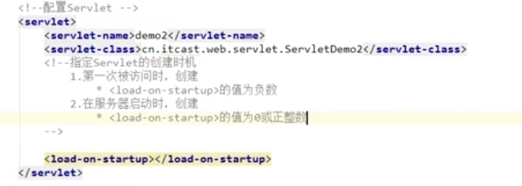

#### servlet执行原理
***
1. web.xml中有<servlet></servlet>和<servlet-mapping></servlet-mapping>的标签来配置请求，其中有自定义的servlet的***全类名***，<font color=red>看到全类名就知道自定义的servlet肯定是通过反射加载的```Class.forName()```方法，然后通过```Class.newInstance()```去实例化一个对象，</font>最后调用其service方法，感觉是通过jdk代理来执行的。

#### servlet生命周期

***

1. ```init()```在对象被创建时执行，单例的只执行一次，一般是第一次被访问时执行

   ***但是，如果配置如下，那么servlet会在tomcat启动的时候被加载***

   

2. ```service()```每次请求都会执行

3. ```destory()```对象销毁时执行，比如tomcat停止运行时（指服务器正常关闭）

#### HTTP 协议数据

***

* 请求消息数据格式

  1. 请求行

     <font color=green>格式：请求方式 请求URL 请求协议/版本</font>

     <font color=green>GET /login.html HTTP/1.1</font>

  2. 请求头

  3. 请求空行

  4. 请求体

  * <font color=green>字符串格式</font>：

    <font color=green>GET /login.html HTTP/1.1</font>

    <font color=green>Accept: application/json, text/plain,</font>
    <font color=green>Accept-Encoding: gzip, deflate</font>
    <font color=green>Accept-Language: zh-CN</font>
    <font color=green>Cache-Control: no-cache</font>
    <font color=green>Connection: Keep-Alive</font>
    <font color=green>Content-Length: 18</font>
    <font color=green>Content-Type: application/json; charset=utf-8</font>
    <font color=green>Cookie: portalid=wbalone; default_serial=1; u_locale=zh_CN; locale_serial=1;</font> <font color=green>sessionid=c895d7d4-7a67-4a60-a24a-5e1d338bee30; _TH_=primary;</font> <font color=green>token=d2ViLDM2MDAscEo5SDhBSnV0Tk5LWjRFUm1GZ3JTVVVOMXVJak5zZXllTVV2UHAvemNlZTZhK0pKOCtnZm5qb25hSjZTVDJwZGpMbTdkNlF4N0lkMGdsWDdoQ1hMWUE9PQ; u_usercode=43c0b56a01b4479da522a28d428153fb; u_logints=1587632058152; tenantid=tenant; userType=userType; typeAlias=typeAlias; userId=43c0b56a01b4479da522a28d428153fb; _A_P_userId=43c0b56a01b4479da522a28d428153fb; _A_P_userType=userType; _A_P_userLoginName=wuyjn; _A_P_userAvator=images%252Fdot.png; _A_P_userName=wuyjn; _A_P_integration=integration; i18next=zh_CN; vertx-web.session=6d805065-1f09-4034-8610-c719f73fc33e</font>
    <font color=green>Host: 10.16.54.23</font>
    <font color=green>random-num: 0.5832274245947651</font>
    <font color=green>Referer: http://10.16.54.23/ss-pas-fe/paramset/?modulefrom=sidebar</font>
    <font color=green>User-Agent: Mozilla/5.0 (Windows NT 10.0; WOW64; Trident/7.0; rv:11.0) like Gecko</font>
    <font color=green>X-Requested-With: XMLHttpRequest</font>